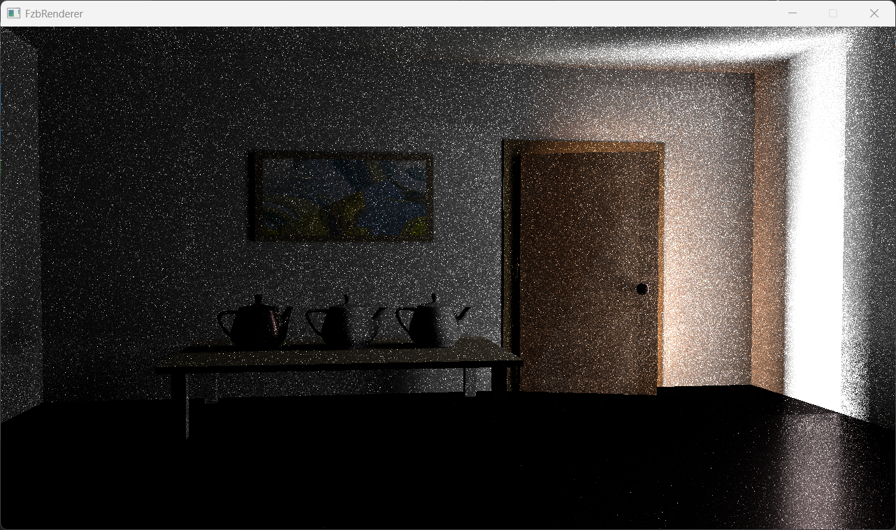

# FzbRenderer

## 项目简介

本项目**不再更新与维护**，接下来的工作将放在[FzbRenderer_nvvk](https://github.com/fzbRun/FzbRenderer_nvvk)
本项目基于 vulkan 和 cuda，对传统的 vulkan renderPass 流程进行封装，并使用 cuda 进行通用并行计算。
本项目目前实现的功能

- **xml 交互**：
  - 用户可以在 renderInfo/renderInfo.xml 中指定使用的渲染器以及相应参数
  - 用户可以在 resources/xxx/sceneInfo.xml 中指定 xxx 场景的信息，如相机参数、材质、光照、mesh(与[mitsuba 3](https://www.mitsuba-renderer.org/)相似)
- **模型读取**：可以对 obj 文件进行读取
- **顶点缓冲优化**：
  - 使用多线程对顶点数据进行压缩，去除冗余顶点数据
  - 所有的 Mesh 共用一个顶点缓冲，即使顶点数据格式不同，如有的只有 pos，有的同时有 pos 和 normal，缓冲除了几个字节的 padding 外没有冗余。
  - 渲染只需要在最开始绑定一次顶点缓冲
- **Shader 变体**：
  - 自定义 shader 类实现宏处理和 shader 变体
  - 每个 shader 变体对应一个 meshSet，只有当 shader 变体改变时才会换绑 pipeline
- **BVH**：使用 cuda 实现 BVH 的构建
- **SVO**：
  - 使用光栅体素化得到均匀体素网格(Buffer)
  - 使用 cuda 构建 SVO
  - [技术文档](https://zhuanlan.zhihu.com/p/1903055363391100483)
- **BSDF 材质**：diffuse、dielectric、roughConductor 和 roughDielectric
- **前向渲染器**: 传统的前向渲染
- **路径追踪渲染器**: 传统的 PathTracing
  - 反射、折射
  - BSDF 重要性采样
  - NEE（均匀采样和球面矩形采样）
- **SVO PathGuiding**：基于 cuda 和 SVO
